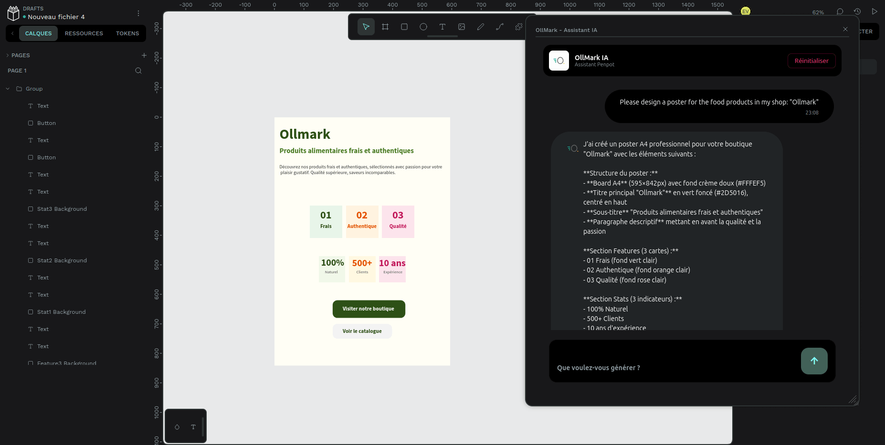

# 🚀 Ollmark-AI-MicroService

<div align="center">

**AI-powered backend for Penpot — enabling real-time design generation, editing, and inspection via LLMs**



</div>

---

## 📦 Overview

**penpot-ai-server** is a Spring Boot microservice that adds an AI layer on top of [Penpot](https://penpot.app).

It exposes:

* a **REST API** for AI interactions
* a **WebSocket channel** for real-time communication with a Penpot plugin

➡️ This allows users to **create, modify, and inspect designs using natural language** powered by LLMs (Ollama or cloud providers).

---

## 🧱 Tech Stack & Requirements

<div align="center">

<table>
<thead>
<tr>
<th align="left">Component</th>
<th align="left">Minimum Version</th>
<th align="left">Role</th>
</tr>
</thead>
<tbody>
<tr>
<td><b>Java (JDK)</b></td>
<td><code>21 (LTS)</code></td>
<td>Runtime for Spring Boot</td>
</tr>
<tr>
<td><b>Apache Maven</b></td>
<td><code>3.9+</code></td>
<td>Dependency management (<code>./mvnw</code> included)</td>
</tr>
<tr>
<td><b>PostgreSQL</b></td>
<td><code>15+</code></td>
<td>Relational persistence (chat memory & config)</td>
</tr>
<tr>
<td><b>Docker & Compose</b></td>
<td><code>24+</code></td>
<td>Local database containerization</td>
</tr>
<tr>
<td><b>Ollama</b></td>
<td><code>0.3+</code></td>
<td>LLM inference engine</td>
</tr>
</tbody>
</table>

</div>

---

## 🏗️ Architecture Overview

```
┌──────────────────────────────────────────────────────────────┐
│              Penpot Plugin (Angular)                         │
│        WebSocket: ws://<HOST>:<PORT>/plugin                  │
└──────────────────────────┬───────────────────────────────────┘
                           │
                           ▼
┌──────────────────────────────────────────────────────────────┐
│                penpot-ai-server (port 8080)                  │
│                                                              │
│      REST /api/ai/chat ──> ConversationChatUseCase           │
│                         │                                    │
│        ┌────────────────▼────────────────┐                   │
│        │        OllamaAiAdapter          │                   │
│        │  • RequestComplexityAnalyzer    │                   │
│        │  • IntentRouterService          │                   │
│        │  • PenpotToolRegistry           │                   │
│        │  • ChatClientFactory            │                   │
│        └────────────────┬────────────────┘                   │
│                         │ Tool calls                         │
│        ┌────────────────▼───────────────┐                    │
│        │     PenpotToolExecutor         │                    │
│        │  → PluginBridge (WebSocket)    │                    │
│        └────────────────────────────────┘                    │
│                                                              │
│           PostgreSQL  <── Chat Memory + Conversations        │
│           Ollama      <── LLM + Embeddings                   │
└──────────────────────────────────────────────────────────────┘
```

---

## ⚡ Quick Start

### 1. Clone the repository

```bash
git clone <repository-url>
cd penpot-ai-server
```

---

### 2. Configure environment variables

```bash
cp .env.example .env
```

Minimal `.env`:

```env
SPRING_PROFILES_ACTIVE=local

SPRING_DATASOURCE_URL=jdbc:postgresql://localhost:5433/penpot_ai
SPRING_DATASOURCE_USERNAME=penpot_ai
SPRING_DATASOURCE_PASSWORD=penpot_ai_secret

DB_HOST=localhost
DB_PORT=5433
DB_NAME=penpot_ai
DB_USER=penpot_ai
DB_PASSWORD=penpot_ai_secret

OLLAMA_BASE_URL=http://localhost:11434/

PENPOT_SERVER_ADDRESS=localhost
PENPOT_WEBSOCKET_PORT=8080

SWAGGER_PASSWORD=changeme

CRYPTO_MASTER_KEY=your_32+_hex_key
```

> ⚠️ Never commit `.env` (already ignored).

---

### 3. Start PostgreSQL (Docker)

```bash
docker compose up -d postgres
```

---

### 4. Run the application

```bash
./mvnw spring-boot:run
```

Or with environment variables:

```bash
export $(grep -v '^#' .env | xargs) && ./mvnw spring-boot:run
```

---

### 5. Verify startup

```bash
curl http://localhost:8080/actuator/health
```

Expected:

```json
{"status":"UP"}
```

---

### 6. Access Swagger UI

```
http://localhost:8080/swagger-ui.html
```

* **User:** `admin_audit`
* **Password:** value of `SWAGGER_PASSWORD`

---

## 🤖 Required Ollama Models

```bash
# Main execution model
ollama pull xxx

# Intent router
ollama pull xxx

# Embedding model (RAG)
ollama pull xxx
```

---

## 🔧 Configuration Profiles

| Profile   | Usage             | Logs  | SQL Visible |
| --------- | ----------------- | ----- | ----------- |
| `local`   | Local development | DEBUG | Yes         |
| `dev`     | Shared dev server | DEBUG | Yes         |
| `preprod` | Staging           | INFO  | No          |
| `prod`    | Production        | WARN  | No          |

---

## 🔑 Environment Variables

### Core

| Variable                     | Description         |
| ---------------------------- | ------------------- |
| `SPRING_DATASOURCE_URL`      | PostgreSQL JDBC URL |
| `SPRING_DATASOURCE_USERNAME` | DB user             |
| `SPRING_DATASOURCE_PASSWORD` | DB password         |
| `CRYPTO_MASTER_KEY`          | Encryption key      |
| `SWAGGER_PASSWORD`           | Swagger access      |

---

### Ollama

| Variable                 | Default                   |
| ------------------------ | ------------------------- |
| `OLLAMA_BASE_URL`        | `http://localhost:11434/` |
| `PENPOT_EXECUTOR_MODEL`  | `qwen3.5:9b`              |
| `PENPOT_ROUTER_MODEL`    | `llama3.1`                |
| `OLLAMA_EMBEDDING_MODEL` | embedding model           |

---

### RAG

| Variable                          | Default |
| --------------------------------- | ------- |
| `PENPOT_RAG_SIMILARITY_THRESHOLD` | `0.5`   |
| `PENPOT_RAG_TOP_K`                | `3`     |
| `PENPOT_CHAT_MEMORY_MAX_MESSAGES` | `20`    |

---

## 🌐 REST API (Quick Reference)

### AI Chat

| Method | Endpoint                           | Description      |
| ------ | ---------------------------------- | ---------------- |
| POST   | `/api/ai/chat`                     | Send message     |
| GET    | `/api/ai/chat/{projectId}/history` | Get history      |
| POST   | `/api/ai/chat/new`                 | New conversation |
| DELETE | `/api/ai/chat/{projectId}`         | Delete history   |

---

## 🔌 WebSocket Plugin

```
ws://localhost:8080/plugin
```

### Flow

1. **Handshake**

```json
{ "type": "session-id", "sessionId": "abc123" }
```

2. **Task execution**

```json
{
  "task": "executeCode",
  "params": { "code": "..." }
}
```

3. **Response**

```json
{
  "type": "task-response",
  "response": { "success": true }
}
```

---

## 🧠 AI Processing Pipeline

```
User Input
   │
   ├─ RequestComplexityAnalyzer
   ├─ IntentRouterService
   ├─ Tool Selection
   └─ LLM Execution (Ollama)
```

### Complexity Levels

| Level    | Usage                 |
| -------- | --------------------- |
| SIMPLE   | Atomic actions        |
| CREATIVE | Design suggestions    |
| COMPLEX  | Multi-step generation |

---

## 📚 RAG System

* 24 pre-indexed marketing templates
* Multi-step retrieval pipeline
* Embedding cache (Caffeine, 10k entries)

---

## 🗄️ Database

```
projects
 └─ conversations
     └─ messages

ai_model_config
spring_ai_chat_memory
```

* Managed with **Flyway**
* Migrations in `db/migration/`

---

## 📄 Logs

* File: `logs/penpot.log`
* Rotation: 10MB × 30 files
* Dynamic log level via Actuator

```bash
curl http://localhost:8080/actuator/loggers/com.penpot.ai
```